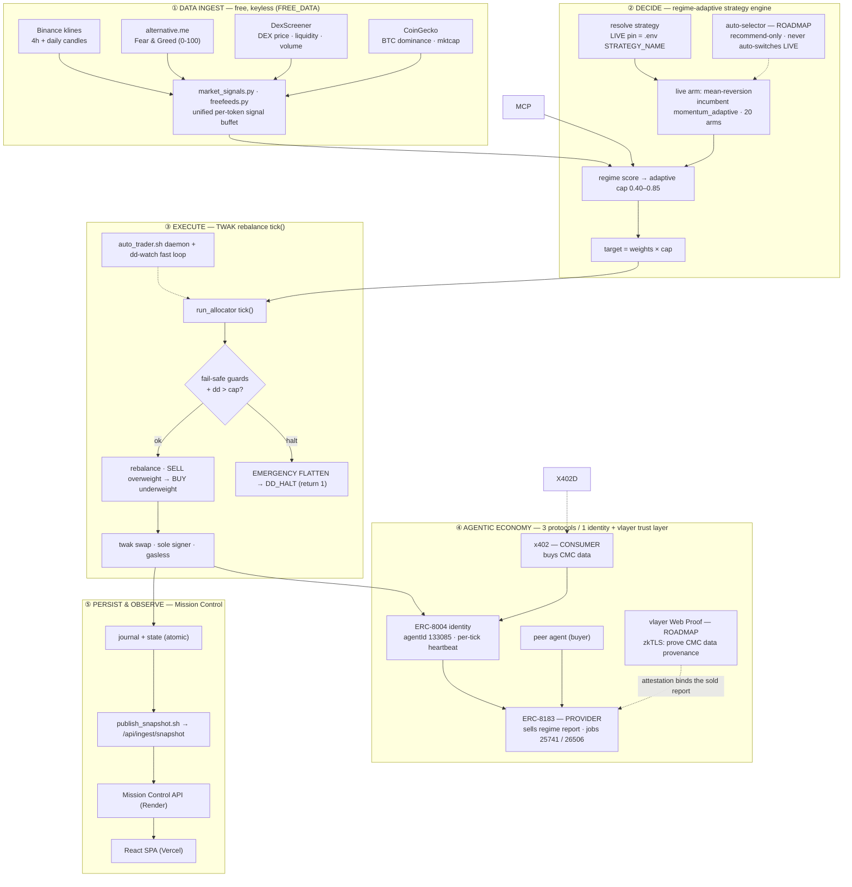
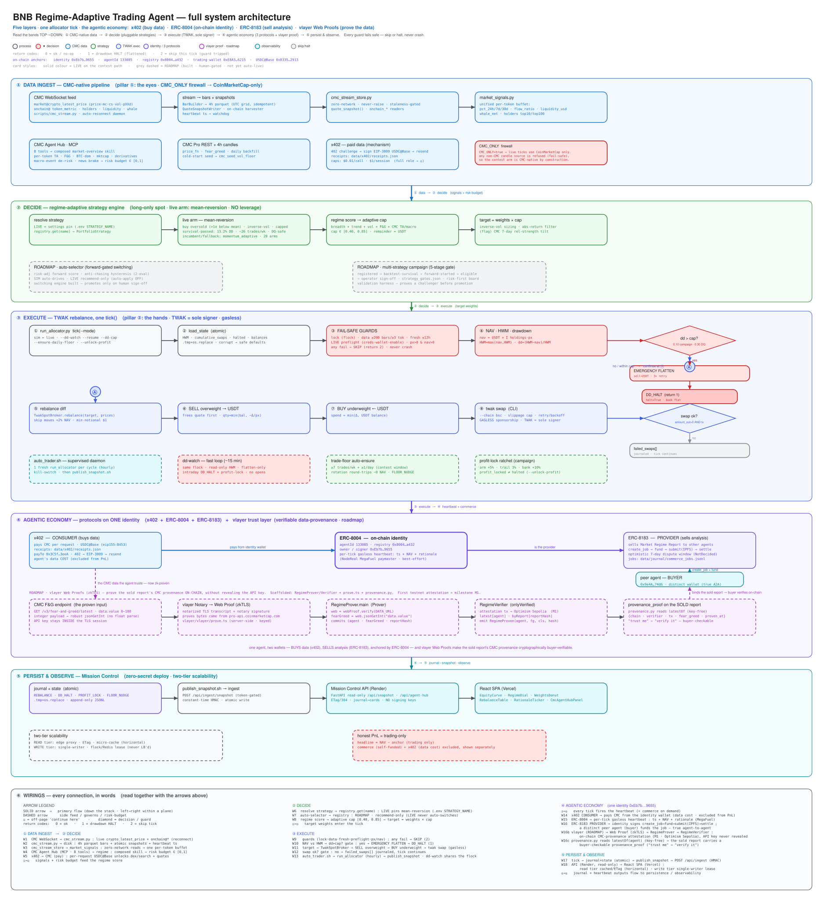

# Architecture — Mission Control (Regime-Adaptive Trading Agent)

> Full-system architecture of the agent. For *why* this approach (the honest negative-edge
> audit) see [docs/bnb_strategy_decision.md](docs/bnb_strategy_decision.md); for the judge-facing
> overview see [README.md](README.md).

> **Update (2026-07): the agent now runs on FREE, keyless data — CoinMarketCap is no longer required.**
> Every live read comes from free public APIs (no key, no account): **Binance** (4h + daily candles) ·
> **alternative.me** (Fear & Greed) · **DexScreener** (DEX price · liquidity · volume) · **CoinGecko**
> (BTC dominance · mktcap) — see [docs/FREE_DATA_SOURCES.md](docs/FREE_DATA_SOURCES.md). Sections that
> describe the **CMC-native pipeline / `CMC_ONLY` firewall / x402 CMC buying** below are the **original
> BNB-hackathon build**, preserved for the record; the live data layer is the free stack.

## TL;DR

A long-only spot **regime-adaptive allocator** on BNB Smart Chain. Every tick it reads market state
from **free, keyless public APIs** (Binance · alternative.me · DexScreener · CoinGecko), scores the
regime, selects + inverse-vol-sizes a book under a regime-adaptive cap, and rebalances through **Trust
Wallet Agent Kit (TWAK)** as the sole signer — with
every guard built to *fail safe* (skip or halt, never crash). The **live arm is mean-reversion**
(`STRATEGY_NAME=mean_reversion`) — the most DQ-safe + active of the registered arms (survival-passed:
**13.2% worst-week DD · ~26 trades/wk · DQ-safe**; forward-validation in progress); `momentum_adaptive`
is the registered incumbent/fallback. No arm claims alpha — see the audit. The agent runs as an
**on-chain economic actor** on top of three protocols:

| Protocol | Role here | Network | On-chain proof |
|---|---|---|---|
| **x402** (HTTP 402) · *original build* | **Consumer** — paid CoinMarketCap per request for data (now runs on free data instead) | Base (`eip155:8453`) | **49 settled** USDC receipts (still on Base) → [data/x402/receipts.json](data/x402/receipts.json) · [docs/x402_receipts.md](docs/x402_receipts.md) |
| **ERC-8004** | **Identity** — on-chain agent NFT; heartbeats NAV + rationale every tick | BSC mainnet | **agentId 133085**, registry `0x8004…a432` → [docs/twak_integration.md](docs/twak_integration.md) |
| **ERC-8183** | **Provider** — sells its Market Regime Report to other agents | BSC mainnet | **jobs 25741 · 26506** → [data/journal/commerce_jobs.jsonl](data/journal/commerce_jobs.jsonl) · [docs/erc8183_agent_commerce.md](docs/erc8183_agent_commerce.md) |
| **vlayer** Web Proofs (zkTLS) · **ROADMAP** | **Trust layer** — proves the sold report's data provenance on-chain (free **alternative.me** F&G) | Optimism Sepolia (testnet) | scaffolded: [vlayer/](vlayer/) prover+verifier + [provenance.py](src/ictbot/agent/provenance.py); M1 = first attestation tx → [docs/vlayer/INTEGRATION_PLAN.md](docs/vlayer/INTEGRATION_PLAN.md) |

> **One agent, two roles:** it **sells** its analysis (ERC-8183) — and in the original build also
> **bought** its data (x402) — both anchored by a single **ERC-8004** identity address (`0xEb7b…9655`).
> Identity key ≠ trading wallet (`0xE8A3…6215`), by design. **vlayer Web Proofs** then close the last
> trust gap — turning the sold report's `data_provenance` from a *claim the buyer must trust* into an
> on-chain, buyer-verifiable attestation that its inputs really came from the free data source
> (**proves** its outputs).

**On-chain anchors:** identity/signer `0xEb7bF36aab4912c955474206EF0b835170389655` · agentId `133085`
· registry `0x8004A169FB4a3325136EB29fA0ceB6D2e539a432` · USDC@Base `0x833589fCD6eDb6E08f4c7C32D4f71b54bdA02913`.

---

## What's live now vs roadmap

Everything in the five layers below is **live on the contest path** unless tagged **ROADMAP**. The
roadmap items are built and tested but kept **human-gated by design** — they showcase where the system
goes, without putting un-promoted automation on real money.

| LIVE now (contest path) | ROADMAP (built · human-gated) |
|---|---|
| **Free data pipeline** (`FREE_DATA=true`: Binance · alt.me · DexScreener · CoinGecko) | Auto-selector **auto-apply** (`STRATEGY_AUTO_APPLY_LIVE` off → recommend-only) |
| `mean-reversion` live arm + regime-adaptive cap | Multi-strategy campaign **promotion** (SIM validation harness) |
| TWAK live execution (sole signer) | The 9 challenger arms (SIM-gated until sign-off) |
| ERC-8004 heartbeat · **Market Data Hub** (live free stack) | TWAK gasless sponsorship |
| Profit-lock · drawdown halt · dd-watch · trade-floor | Continuous ERC-8183 commerce (today: operator-run; 2 real mainnet jobs served) |
| Mission Control dashboard (read-only) | **vlayer Web Proofs** — verifiable data-provenance (scaffolded; flag-gated `VLAYER_ENABLED=false`; M1 = first testnet attestation) |

## The five layers (at a glance)



### Detailed flow diagram

The full, card-level execution diagram (every guard, terminal, and return code) is generated and kept
in sync with the journals — regenerate with `make architecture`:



View [docs/architecture.svg](docs/architecture.svg) in any browser, edit
[docs/architecture.excalidraw](docs/architecture.excalidraw), or open the high-res
[docs/architecture.png](docs/architecture.png).

---

## ① Data ingest — free, keyless pipeline

Every live read comes from **free public APIs — no key, no account** (`FREE_DATA=true`, the default).
The legacy `cmc_*`-named seams route to these transparently, so the strategy/report code is unchanged.
See [docs/FREE_DATA_SOURCES.md](docs/FREE_DATA_SOURCES.md).

| Stage | File | What it does |
|---|---|---|
| Candles (4h + daily) | [src/ictbot/data/freefeeds.py](src/ictbot/data/freefeeds.py) | **Binance** klines via `data-api.binance.vision` (geo-open, no key): `binance_klines(sym, "4h"/"1d")` → the 4h close matrix + the daily seed. Also `binance_ticker_price` for execution sizing. |
| Fear & Greed | [src/ictbot/data/freefeeds.py](src/ictbot/data/freefeeds.py) | **alternative.me** `/fng/` → the 0–100 sentiment integer (`alt_me_fear_greed`) feeding the regime score. |
| DEX signals | [src/ictbot/data/dexscreener.py](src/ictbot/data/dexscreener.py) | **DexScreener** `/tokens/v1/bsc` → per-token price · liquidity · 24h volume · price change · buy/sell tx counts (`dex_signals`). |
| Macro | [src/ictbot/data/freefeeds.py](src/ictbot/data/freefeeds.py) | **CoinGecko** `/global` → BTC dominance + total-mktcap 24h Δ (`coingecko_global`) for the composed market overview. |
| Composed overview | [src/ictbot/data/free_overview.py](src/ictbot/data/free_overview.py) | `free_market_overview()` blends F&G + macro + DEX breadth into a numeric **risk budget ∈ [0,1]** and regime label — the free replacement for the old CMC MCP *skill*. |
| Unified signals | [src/ictbot/strategy/market_signals.py](src/ictbot/strategy/market_signals.py) | One per-token buffet: `pct_24h/7d/30d`, `flow_ratio`, `liquidity_usd`, `volume_24h`, `market_cap`. Each field independently optional (holder/whale fields have no free source → `None`). |

> **Original BNB-hackathon pipeline (in-repo, behind `FREE_DATA=false`):** the CMC-native stack —
> `scripts/cmc_stream.py` (WebSocket harvest → 4h parquet), `cmc_stream_store.py` (zero-network readers,
> `CMC_ONLY` firewall), `cmc_agent_hub.py` (8-of-12 MCP tools → risk-budget skill), and
> `x402_cmc.py` (the **x402** pay-per-call mechanism, 49 USDC receipts on Base) — is preserved as the
> documented original build. Full x402 role in layer ④.

## ② Decide — regime-adaptive strategy engine

A pluggable engine: an arm picks names, inverse-vol sizes them, and a regime-adaptive cap sets how much
NAV is deployed — same wrapper for every arm.

- **Live arm — `mean-reversion`** ([src/ictbot/strategy/adapters/mean_reversion.py](src/ictbot/strategy/adapters/mean_reversion.py))
  — pinned via `.env STRATEGY_NAME=mean_reversion`. It buys oversold names (close >1σ below the rolling
  mean / lower Bollinger band), inverse-vol weighted, regime-capped. Chosen because it is the **most
  DQ-safe + active** registered arm: **survival-passed — 13.2% worst-week DD, ~26 trades/wk, DQ-safe**
  ([data/reports/strategy_gates.json](data/reports/strategy_gates.json)). It does **not** claim alpha
  (no arm does — see the audit); forward-validation is in progress. Treat it as the *safest, most-active*
  way to satisfy the contest's survival + participation scoring, not as an edge.
- **Registry & incumbent** ([src/ictbot/strategy/registry.py](src/ictbot/strategy/registry.py)) — **20
  registered = 11 strategies + 9 `BNB_STRATEGY_0x` aliases**. `momentum_adaptive` (17.3% DD, ~15
  trades/wk) is the registered **incumbent / fallback** — the default whenever `STRATEGY_NAME` is unset.
- **Selection gate** ([src/ictbot/runtime/strategy_select.py](src/ictbot/runtime/strategy_select.py)) —
  **LIVE** runs the `.env`-pinned arm; **SIM** can switch via `strategy_select.json` (dashboard-driven).
  Safety by construction.
- **Regime → cap** — breadth + trend + vol + Fear&Greed + the free composed risk budget scale the deploy cap
  within **[0.40, 0.85]** (arm-agnostic); remainder stays in USDT. `target = weights × cap`.

**Roadmap (built, human-gated — not yet auto-live):**
- **Auto-selector / forward-gated switching** ([docs/strategy_autoselector.md](docs/strategy_autoselector.md))
  — risk-adjusted forward score among DQ-safe arms with anti-chasing hysteresis. **SIM auto-drives; LIVE
  is recommend-only** (`STRATEGY_AUTO_APPLY_LIVE` off) — a real-money arm changes only on operator
  sign-off. The switching engine is built; keeping it human-gated is a deliberate safety choice.
- **Multi-strategy campaign gate** — `make campaign` runs every challenger through a 5-stage validation
  gate (registered → backtest-survival → forward-started → forward-eligible → operator sign-off) writing
  verdicts to `strategy_gates.json`. SIM-only validation harness; no auto-promote.
- **Challenger arms** — the other 9 registered arms (`momentum_voltarget`, `dual_momentum`, `rotation`,
  `breakout`, `momentum_cmc`, `grid`, …) stay SIM-gated until they clear the gate **and** an operator
  pins them.

Config is **three layers** (change all to stay coherent): `.env` (runtime override) > `settings.py`
default > [config/strategy.md](config/strategy.md) (natural-language label/identity).

## ③ Execute — TWAK rebalance tick()

The allocator emits target weights; [src/ictbot/exec/bsc_spot_live.py](src/ictbot/exec/bsc_spot_live.py)
(`TwakSpotBroker`) moves the live book toward them through
[src/ictbot/exec/twak_client.py](src/ictbot/exec/twak_client.py) — **TWAK is the sole signer**, gasless
when sponsored. Order: **sell overweight → USDT first**, then **buy underweight ← USDT**; moves <2% of
NAV and dust <$1 are skipped.

`run_allocator.py tick()` is fully guarded — each guard fails safe:

| Guard | Outcome |
|---|---|
| lock (`flock`, per-mode) | another tick running → **SKIP (2)** |
| data sufficient (≥200 bars, ≥3 tokens) · candles fresh (≤12h) | thin/stale → **SKIP (2)** |
| LIVE preflight (creds · wallet · `ENABLE_LIVE_TRADING`) | missing → **SKIP (2)** |
| prices > 0 & NAV > 0 | guards a *false* halt → **SKIP (2)** |
| `dd > cap?` (0.10 campaign · 0.30 DQ) | breach → **EMERGENCY FLATTEN → DD_HALT (return 1)** |
| `swap ok?` (amount_out > 0 AND tx) | failure → journaled in `failed_swaps[]`, tick **continues** |

Operational wrappers: [scripts/auto_trader.sh](scripts/auto_trader.sh) is a supervised daemon running
one fresh `run_allocator` per cycle (hourly) then `publish_snapshot.sh`; a **dd-watch fast loop**
(~15 min, same flock, flatten-only) gives "drawdown = reaction time" — slow rebalance, fast intraday
monitor. A trade-floor auto-ensure (≥7 trades/wk + ≥1/day) and a profit-lock ratchet round out the
campaign controls.

## ④ Agentic economy — three protocols + a vlayer trust layer

All on **one identity wallet** (`0xEb7b…9655`) — distinct by design from the TWAK trading wallet (`0xE8A3…6215`):

- **ERC-8004 — identity** ([src/ictbot/agent/identity.py](src/ictbot/agent/identity.py)): on-chain agent
  NFT **agentId 133085** in registry `0x8004…a432`. Every tick `write_heartbeat()` publishes
  `set_metadata{ts, nav, rationale}` — gasless via NodeReal MegaFuel, best-effort (never aborts a tick).
  The natural-language rationale comes from [src/ictbot/agent/rationale.py](src/ictbot/agent/rationale.py).
- **x402 — consumer** *(original build; now runs on free data)* ([src/ictbot/data/x402_cmc.py](src/ictbot/data/x402_cmc.py)):
  paid CoinMarketCap per request in USDC on Base (`payTo 0x3C5f…3eeA`) — a **data cost** excluded from
  headline PnL. Proof: **49 settled receipts**, still on Base →
  [data/x402/receipts.json](data/x402/receipts.json).
- **ERC-8183 — provider** ([src/ictbot/agent/commerce.py](src/ictbot/agent/commerce.py)): sells the CMC
  Regime Report ([src/ictbot/agent/regime_report.py](src/ictbot/agent/regime_report.py)) to other
  agents — `create_job → fund → submit signed deliverable (IPFS) → settle`, optimistic ~7-day dispute
  window (`NotDecided` selector `0x17be5b7b` is *expected*, not a failure). Proof: **jobs 25741 · 26506**
  on BSC mainnet, bought by a distinct peer agent (`0x9e4A…74d6`) — genuine agent-to-agent.
- **vlayer Web Proofs — trust layer (ROADMAP)** ([vlayer/](vlayer/) + [src/ictbot/agent/provenance.py](src/ictbot/agent/provenance.py)):
  the report the provider *sells* carries a `data_provenance` string a buyer must **trust**. vlayer
  **Web Proofs (zkTLS)** replace that with **proof**: `RegimeProver.main` verifies a notarized
  **alternative.me** Fear&Greed TLS response (`_parseUint(jsonGetString("data.0.value"))` — free,
  keyless) and `RegimeVerifier` (`onlyVerified`) records an attestation keyed by `agent` and
  `reportHash`. `provenance.py` reads it back (read-only, key-free) so the sold ERC-8183 deliverable gains
  a buyer-checkable `provenance_proof`. Flag-gated OFF (`VLAYER_ENABLED=false`); M1 = first attestation tx
  on Optimism Sepolia. Full plan: [docs/vlayer/INTEGRATION_PLAN.md](docs/vlayer/INTEGRATION_PLAN.md).

## ⑤ Persist & observe — Mission Control

- **Atomic persistence** — per tick, the journal (`REBALANCE`, `DD_HALT`, `PROFIT_LOCK`, `FLOOR_NUDGE`,
  `RECON_DRIFT`) appends to JSONL and state writes via `.tmp + os.replace`. Readers in
  [src/ictbot/api/reads.py](src/ictbot/api/reads.py) do bounded tail reads.
- **Snapshot push** — `publish_snapshot.sh` POSTs to `/api/ingest/snapshot`
  ([src/ictbot/api/ingest.py](src/ictbot/api/ingest.py)), token-gated by a constant-time HMAC of
  `INGEST_TOKEN`, atomic write, cache-invalidating.
- **Dashboard** — read-only FastAPI on Render (`/api/snapshot` with ETag/304, `/api/market-data-hub`
  for the live free-data stack) + a React SPA on Vercel (EquityCurve · RegimeDial · WeightsDonut ·
  RebalanceTable · RationaleTicker · MarketDataHubPanel). **No signing keys** in the cloud — a leak can
  only spoof the dashboard, never move funds.
- **Two-tier scalability** ([SCALABILITY.md](SCALABILITY.md)) — **read tier** is horizontal (edge proxy
  + ETag + micro-cache, pluggable file|redis store); **write tier** is a single never-load-balanced
  writer (flock locally, Redis lease cross-host).
- **Honest PnL** — headline is **trading-only** (`NAV − anchor`). Commerce (self-funded buyer+provider →
  ~−gas) and x402 (data cost) are **excluded** and shown as separate context, never blended in.

---

## End-to-end flow (one tick)

`Free data` (Binance · alt.me · DexScreener · CoinGecko) → [freefeeds.py](src/ictbot/data/freefeeds.py) · [dexscreener.py](src/ictbot/data/dexscreener.py)
→ [market_signals.py](src/ictbot/strategy/market_signals.py) (+ free composed risk budget) →
strategy decision (regime score → adaptive cap → target weights) → [TwakSpotBroker.rebalance()](src/ictbot/exec/bsc_spot_live.py)
(sell → buy via `twak swap`, sole signer) → **ERC-8004 heartbeat** + (on demand) **ERC-8183 commerce** →
atomic journal/state → `publish_snapshot.sh` → Mission Control dashboard. Free data → decision →
execution → display lands within ~10s.

## Safety & DQ-engineering

- **Fail-safe guards** — every input/decision guard skips or halts; a tick never crashes (return codes
  `0` ok · `1` halt · `2` skip).
- **Drawdown** — `dd > cap` → emergency flatten (3× retry) → `DD_HALT`; the dd-watch fast loop catches
  intraday breaches between rebalances.
- **DQ floors** — ≥7 trades/week (rotation round-trips at ~0 NAV if short) keeps the contest path
  compliant; the auto-selector never auto-switches LIVE. (The original build also enforced a `CMC_ONLY`
  data firewall — moot now that the agent runs on the free stack.)
- **Zero-secret deploy** — cloud holds no funds keys; identity key ≠ trading key.

## Reproduce the diagram

```bash
make architecture          # → docs/architecture.{excalidraw,svg,png}
```

[scripts/gen_architecture.py](scripts/gen_architecture.py) derives the x402 receipt count/total and the
ERC-8183 job ids **live from the journals** at build time, and self-asserts that every layer token is
present — so this diagram cannot silently drift from the implementation.

## Further reading

- [docs/bnb_strategy_decision.md](docs/bnb_strategy_decision.md) — the locked decision record (why this strategy)
- [docs/cmc_candles.md](docs/cmc_candles.md) — the CMC-native cutover (zero CEX on the contest path)
- [docs/twak_integration.md](docs/twak_integration.md) · [docs/x402_receipts.md](docs/x402_receipts.md) · [docs/erc8183_agent_commerce.md](docs/erc8183_agent_commerce.md) — the three protocols in depth
- [docs/cmc_agent_hub.md](docs/cmc_agent_hub.md) · [docs/mcp_wiring.md](docs/mcp_wiring.md) — CMC Agent Hub / MCP plumbing
- [SCALABILITY.md](SCALABILITY.md) — the two-tier dashboard scaling design
