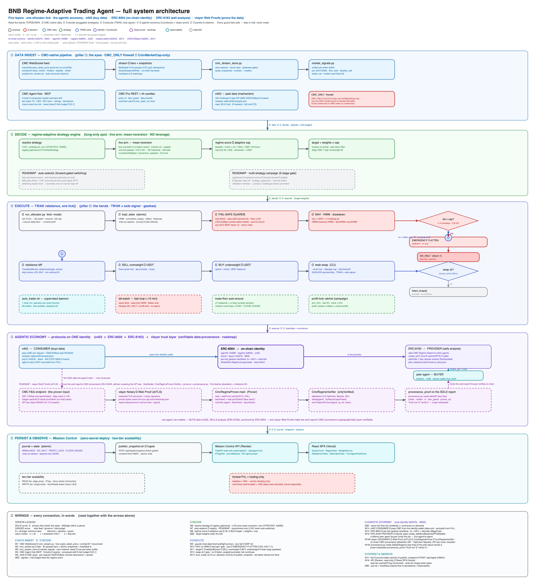

<p align="center">
  
</p>

# Mission Control — a self-custody AI trading agent that runs its own vlayer-verified two-sided economy

**A self-custody AI trading agent that doesn't just trade — it runs a two-sided on-chain economy:
one ERC-8004 identity that *sells* its market read to other agents via **ERC-8183** (IPFS-pinned),
with the sold report's **data provenance made buyer-verifiable on-chain by vlayer Web Proofs
(zkTLS)** — "verify it," not "trust me." Underneath it's a regime-adaptive, long-only spot allocator
over an 8-token universe (`BNB, ETH, CAKE, LINK, UNI, AVAX, DOT, DOGE`) — live-arm mean-reversion —
signed end-to-end by Trust Wallet Agent Kit (TWAK), fed entirely by **free, keyless market data**,
heartbeating its reasoning on-chain each tick it runs.**

> **Update (2026-07): the agent now runs on FREE, keyless data — CoinMarketCap is no longer
> required.** Every live read comes from free public APIs with no key and no account: **Binance**
> (4h + daily candles) · **alternative.me** (Fear & Greed) · **DexScreener** (DEX price · liquidity ·
> volume) · **CoinGecko** (BTC dominance · mktcap). The dashboard's live **Market Data Hub** surfaces
> the free stack, and the vlayer Web Proof (below) now attests the **alternative.me** response. See
> [`docs/FREE_DATA_SOURCES.md`](docs/FREE_DATA_SOURCES.md). The sections below document the original
> BNB-hackathon build (CMC Agent Hub · x402 · MCP), preserved for the record.

Originally built for **BNB Hack: AI Trading Agent Edition** (Track 1 — Autonomous Trading Agents),
stacking three sponsor pillars — a CoinMarketCap Agent Hub (eyes) · **TWAK** (hands) · the on-chain
agent SDK (identity). It is now positioned as a **vlayer** project: the data layer runs on free,
keyless sources and the sold report's data provenance is verified on-chain with vlayer Web Proofs.

We audited this universe for a long-only edge **five independent ways and found none** — so instead of
pretending alpha, we engineered for the contest's actual scoring function: **survival + participation**.
The **live arm is mean-reversion** — the most DQ-safe and active of our registered arms (worst-week
drawdown **13.2%**, far inside the 30% disqualification line; **~26 trades/wk** vs the 7-trade floor;
forward-validation in progress), with `momentum_adaptive` (17.3% DD, ~15 trades/wk) as the registered
incumbent/fallback. It **participates** when the live week is risk-on and **defends** when it isn't.
Honest bottom line: we don't claim 30-40% — nobody credibly can on these tokens in 7 days. We claim the
best risk-controlled, regime-adaptive, fully self-custody agent in the field.

### By the numbers — data processed so far  *(as of 2026-06-21 · live figures "and counting")*

| Metric | Count | What it shows |
|---|--:|---|
| CMC 4h candles processed | **35,304** | 4,413 × 8 tokens — live WebSocket + backfill (`data/cache/cmc/*/4h.parquet`) |
| Live CMC WebSocket channels | **7** | price + 6 on-chain: token_metric · holders · liquidity · token_agg · whale · pool_metric |
| BSC on-chain universe targeted | **149** | BEP-20 tokens (`platform_id=14`) the same harvest scales to |
| Rolling 7-day backtest windows | **2,338** | the negative-edge audit (+ 2,298 more for the CMC-lever A/B) |
| x402 micropayments settled (Base) | **49** | real USDC, $0.49 — and counting (`data/x402/receipts.json`) |
| ERC-8183 commerce jobs (BSC mainnet) | **2** | jobs 25741 · 26506, IPFS-pinned (`data/journal/commerce_jobs.jsonl`) |
| Strategy arms registered / on forward tracks | **20 / 10** | 11 strategies + 9 aliases; 10 on live paper tracks (`data/forward/*`) |
| CMC Agent Hub MCP tools wired | **8 / 12** | each folded into a real decision |
| Code · tests · dashboard | **~38k LOC · 1,600+ tests · 30 components** | 184 test files; **112 MB** journaled/cached market data |

**Scale & future scope:** 8 contest tokens today, but the same CMC WebSocket harvest + zero-network
read store already track the **149-token BSC universe** — and the read tier is horizontally
**cache-first** while the write tier is a single, never-load-balanced writer
([SCALABILITY.md](SCALABILITY.md)). Adding tokens or strategy arms is **config, not re-architecting.**
Full system view: **[ARCHITECTURE.md](ARCHITECTURE.md)** (diagram in §11).

---

## 1. See it live (judges: click these)

| What | Where |
|---|---|
| 📊 Mission Control dashboard (React, Vercel) | <https://bnb-mission-control-two.vercel.app> |
| 🔌 Read-only API (FastAPI, Render) | [`/api/health`](https://bnb-mission-control-api.onrender.com/api/health) · [`/api/pillars`](https://bnb-mission-control-api.onrender.com/api/pillars) · [`/api/nav`](https://bnb-mission-control-api.onrender.com/api/nav) |
| ⛓ Trading wallet (contest-registered, TWAK-custodied) | [`0xE8A30d24BbA030D3e8a844bD1c4F6e1374EA6215`](https://bscscan.com/address/0xE8A30d24BbA030D3e8a844bD1c4F6e1374EA6215) |
| 🪪 ERC-8004 identity — **agentId 133085** (heartbeats every tick) | [identity wallet txs](https://bscscan.com/address/0xEb7bF36aab4912c955474206EF0b835170389655) · [registry token](https://bscscan.com/token/0x8004A169FB4a3325136EB29fA0ceB6D2e539a432?a=133085) |
| 🔁 Sample TWAK-signed swap (BSC) | [`0x9d64…67d1`](https://bscscan.com/tx/0x9d64945b28ce5f217471299599bb30406ac5a9f7a6fb873c917aa697aa5867d1) · [`0xf08f…0380`](https://bscscan.com/tx/0xf08f1b4f0b7d00a23ff7255f6da70270dbfba389b5f19d182dd055ec6a5c0380) |
| 🎬 Demo video | `<TBD: demo URL — recorded per DEMO.md>` |
| 🏆 DoraHacks submission | `<TBD: BUIDL URL>` |

```bash
curl https://bnb-mission-control-api.onrender.com/api/health    # {"ok":true,...}
curl https://bnb-mission-control-api.onrender.com/api/pillars   # all three pillars, live status
```

## 2. The strategy — regime-adaptive allocator (live arm: mean-reversion)

The engine is **pluggable**: an arm selects names, sizes them by **inverse volatility** (30-bar), and a
**regime-adaptive cap** sets how much NAV is deployed — the same wrapper for every arm. Each rebalance
(≈daily) over the 8 contest tokens:

1. **Select** per the live arm's rule. The live arm is **mean-reversion**: buy oversold names trading
   **>1σ below their rolling mean** (lower Bollinger band) — a contrarian, high-activity stance that
   trades every rebalance. (The incumbent `momentum_adaptive` instead ranks by 120-bar return and holds
   the top-2; it stays the registered fallback.)
2. **Size** holdings by **inverse volatility** (30-bar) — calmer names get more capital.
3. **Deploy adaptively** — the deployment cap is not a frozen number. A **live risk-on score** (basket
   breadth + index trend + volatility + CMC Fear & Greed) scales it inside the participatory band
   **[0.40, 0.85]**: ~0.85 when the basket trends up, pulled toward 0.40/cash when it doesn't.
4. **Rebalance** toward the target book via **TWAK spot swaps** (sells before buys).

No SL/TP brackets — an AMM swap has no native stop. Risk control = the adaptive cap + diversification +
a hard **drawdown halt** (NAV vs high-water mark → flatten + stop) + an intraday dd-watch.

**Why mean-reversion is the live arm:** across every arm the edge is ~zero (see §3), so we pin the one
that best serves the scoring function — mean-reversion is the most **DQ-safe** (13.2% worst-week DD) and
**active** (~26 trades/wk) of the registered arms. Changing arms is **operator-gated** (the auto-selector
only *recommends* — see "Live now vs roadmap" below).

The regime-adaptive **cap** is arm-agnostic and provably reacts to regime (verified across the 8-token
history, on the incumbent):

| Regime | Mean deploy cap |
|---|---|
| BULL | **0.78** — deploys, captures upside |
| BEAR | **0.45** — defends into cash |
| CHOP | **0.52** — volatility-cut |

Adaptive vs a frozen 0.85 cap (incumbent, rolling-7-day backtest, 0.70% round-trip friction): keeps most
of the upside (p95 **+10.4%** vs +12.3%) at materially lower worst-week drawdown (**17.6% vs 22.3%**).

**Live now vs roadmap.** *Live on the contest path:* the mean-reversion arm, the regime-adaptive cap,
TWAK live execution, ERC-8004 heartbeat, x402 paid data, drawdown halt + dd-watch + profit-lock +
trade-floor, and the Mission Control dashboard. *Roadmap (built, human-gated):* the **auto-selector**
(forward-gated switching — recommend-only in LIVE, `STRATEGY_AUTO_APPLY_LIVE` off), the multi-strategy
campaign promotion gate, and the 9 challenger arms — all SIM-validated, promoted only on operator
sign-off. We ship the switching engine but keep arm changes human-gated by design.

Code: [`strategy/adapters/mean_reversion.py`](src/ictbot/strategy/adapters/mean_reversion.py) (live arm) ·
[`strategy/momentum_allocator.py`](src/ictbot/strategy/momentum_allocator.py) (incumbent) ·
[`strategy/regime_score.py`](src/ictbot/strategy/regime_score.py) ·
runtime [`scripts/run_allocator.py`](scripts/run_allocator.py)

## 3. Why this strategy — the honest negative-edge audit

Most hackathon agents will claim alpha. We audited for it, at realistic DEX friction, **five
independent ways — and every test came back negative**:

| Test | Result |
|---|---|
| ICT POI/MSS/FVG entry stack | negative out-of-sample expectancy ([findings.md](docs/findings.md)) |
| Trend pullback (selective, 4h) | only ETH holds; ~0.6 trades/wk — too rare |
| Trend loosened to 1h | enough trades, edge gone (all TEST windows negative) |
| Friction sweep 0.10% → 0.70% | net basket expectancy negative even at 0.10% |
| Portfolio search, **2,338 rolling 7-day windows** | every strategy's median weekly return ≤ 0 |

A 7-day result on 8 liquid majors is variance around breakeven, gated by a 30%-drawdown
disqualifier. So the objective function is **survival + participation + craft** — and every design
choice above follows from that. Reproduce it: `make validate_trend` (the audit) and
`make validate_allocator` (the DQ-safety proof). Full audit trail:
[docs/bnb_strategy_decision.md](docs/bnb_strategy_decision.md).

## 4. The three pillars (Track 1: CMC + Trust Wallet + BNB AI Agent SDK)

The agent is an on-chain economic actor on a **three-protocol stack — x402 (buys data) · ERC-8004
(on-chain identity) · ERC-8183 (sells its analysis)** — all anchored on one identity wallet
(`0xEb7b…9655`), distinct by design from the TWAK trading wallet (`0xE8A3…6215`), with a **vlayer
Web-Proofs trust layer** on the roadmap that makes the sold analysis' CMC provenance verifiable
on-chain (④+ below). For the full layered system view (data → decide → execute → economy → observe),
see **[ARCHITECTURE.md](ARCHITECTURE.md)**.

```
   config/strategy.md  (natural-language strategy — "the rules you set")
            │  parse once → AllocatorParams + deploy band [0.40, 0.85]
            ▼
  ┌─ each rebalance tick ──────────────────────────────────────────────────┐
  │  ① CMC      → price + Fear&Greed + macro + pre-computed TA   (the eyes) │
  │  ② regime score → adaptive cap → target weights                         │
  │  ③ rationale.explain(...) → plain-language decision     (the voice)     │
  │  ④ TWAK     → spot swaps toward targets, sole signer    (the hands)     │
  │  ⑤ ERC-8004 → on-chain heartbeat: ts + NAV + rationale  (the identity)  │
  └──────────────────────────────────────────────────────────────────────────┘
```

- **① CMC Agent Hub (eyes)** — [`data/cmc.py`](src/ictbot/data/cmc.py) live price + Fear & Greed
  drive the regime score; [`data/cmc_agent_hub.py`](src/ictbot/data/cmc_agent_hub.py) reads CMC's
  **Data MCP** (`mcp.coinmarketcap.com/mcp`, `X-CMC-MCP-API-KEY`) — the live agent calls **8 of the
  12 tools**, each into a real decision: `get_crypto_technical_analysis` (per-token TA → ranking +
  cap), `get_global_metrics_latest` (F&G / BTC-dominance / mktcap → regime), `trending_crypto_narratives`,
  `get_crypto_marketcap_technical_analysis` (global-mktcap regime term), `get_global_crypto_derivatives_metrics`
  (leverage/funding **fragility brake** on the cap), `get_upcoming_macro_events` (**de-risk into**
  CPI/FOMC), `get_crypto_quotes_latest` (CMC-ID resolution + price cross-check), `get_crypto_latest_news`.
  These compose into a **market-overview skill** with a numeric risk budget that modulates the deploy
  cap. **Honest note:** CMC's hosted *Skills Marketplace* is a separate agent-side router with no
  callable tool endpoint (the `/skills*` paths 404 — proven by [`scripts/probe_agent_hub.py`](scripts/probe_agent_hub.py)),
  so this skill is labeled `skill_source="composed"` — built *on* the Data MCP, not consumed *from* the
  Marketplace. [`data/x402_cmc.py`](src/ictbot/data/x402_cmc.py) implements the **native x402
  pay-per-call path** (real EIP-3009 USDC signing on Base, receipts journaled). The dashboard's CMC
  Agent Hub panel shows which tools were called, the skill the agent acted on, and x402 spend live.
- **② Trust Wallet / TWAK (hands)** — [`exec/twak_client.py`](src/ictbot/exec/twak_client.py) +
  [`exec/bsc_spot_live.py`](src/ictbot/exec/bsc_spot_live.py): TWAK is the **sole signer** for every
  swap (`--slippage` capped, `--max-usd` bounded, sells-before-buys rebalancer). Keys never leave
  the local twak keystore — registration (`twak compete register`) and even the gas top-up that
  funded the identity wallet went through twak's own CLI.
- **③ BNB AI Agent SDK (identity)** — [`agent/identity.py`](src/ictbot/agent/identity.py): the agent
  holds **ERC-8004 agentId 133085** on the BSC identity registry, minted from its own pinned
  identity wallet, with the trading wallet declared in the NFT metadata. Every allocator tick
  publishes a **`heartbeat` metadata write on-chain** (timestamp + NAV + the natural-language
  rationale) — continuous, verifiable on-chain activity, not a one-shot mint. Identity key ≠ funds
  key, by design.
- **④ Agent commerce / ERC-8183 (monetizes its analysis)** —
  [`agent/commerce.py`](src/ictbot/agent/commerce.py): the SDK's flagship **ERC-8183** commerce layer
  on the same identity. The agent **sells its live Market Regime Report to other agents** for an on-chain
  fee — full `create_job → fund → submit signed deliverable → settle` loop, deliverables pinned to
  **IPFS**. **2 real jobs served on BSC mainnet** (`25741`, `26506`, in
  [`data/journal/commerce_jobs.jsonl`](data/journal/commerce_jobs.jsonl)). So the agent both **buys**
  data (x402) and **monetizes** its output (ERC-8183) — a two-sided agent economy on one address.
  Settlement is optimistic: a served job sits `SETTLE_DEFERRED` until its ~7-day dispute window closes
  (the `NotDecided` selector `0x17be5b7b` is *expected*, not a failure), then
  [`settle_pending_jobs()`](src/ictbot/agent/commerce.py) finalizes it on-chain.
- **④+ Verifiable provenance / vlayer Web Proofs (ROADMAP)** — [`vlayer/`](vlayer/) +
  [`agent/provenance.py`](src/ictbot/agent/provenance.py): today the sold report's `data_provenance` is a
  *claim the buyer must trust*. vlayer **Web Proofs (zkTLS)** make it **proof** — `RegimeProver`
  verifies a notarized **alternative.me** Fear & Greed TLS response (free, keyless) and
  `RegimeVerifier` records an on-chain attestation bound to the exact report hash, so the ERC-8183
  deliverable carries a buyer-checkable `provenance_proof`. The agent thus **buys** its inputs (x402)
  *and* **proves** its outputs (vlayer). Flag-gated OFF; M1 = first attestation on Optimism Sepolia —
  see [`docs/vlayer/INTEGRATION_PLAN.md`](docs/vlayer/INTEGRATION_PLAN.md).
- **The agent talks** — [`agent/strategy_spec.py`](src/ictbot/agent/strategy_spec.py) parses the
  natural-language strategy; [`agent/rationale.py`](src/ictbot/agent/rationale.py) journals a
  plain-language explanation of every decision (visible in the dashboard ticker and on-chain in the
  heartbeat).

## 5. Evidence I — the CMC data levers earn their place (A/B-tested)

The engine and candles held constant, only the CMC lever changes — judged on risk-penalized return
(`total_return − worst_week_dd`) over **2,298 rolling 7-day windows** at contest-realistic 0.70%
friction, on a down-leaning 14-month sample (so the question is which lever *loses less / draws
down less*):

| Lever | Δscore | Δ worst-week DD | Verdict |
|---|---:|---:|---|
| Enhanced regime (CMC macro: BTC-dominance, total-mktcap, F&G-momentum → cap) | **+8.6 pts** | −1.0 pt | ON |
| `ta_cap` (CMC pre-computed TA → cap) | **+12.4 pts** | −1.0 pt | ON |
| `ta_rank` (CMC TA → token ranking) | **+5.5 pts** | ±0 | wired into the LIVE ranking path (A/B-gated: `ALLOC_TA_ENABLED`) |
| **`enhanced+ta` (macro + TA in the cap)** | **+12.7 pts** | **−1.3 pts** | **best arm** |
| Over-stacked `full_cmc` / bare tilt / multi-TF ranking | negative | — | kept OFF |

Promotion discipline: SIM-first — levers run on the SIM track and are forward-validated before the
contest entry adopts them. Full table + caveats: [docs/cmc_pnl_ab.md](docs/cmc_pnl_ab.md).
*Data: Binance · alternative.me · DexScreener · CoinGecko (free, keyless). Original build: CoinMarketCap.*

## 6. Evidence II — forward paper validation (the real test)

A backtest cannot validate a forward week, so the agent runs a scheduled **paper tick on genuinely
unseen data** from build-finish to contest-open (`make forward_report`):

> **As of 2026-06-13**: NAV **1000 → ~1003 (+0.3%)** on the campaign track, max drawdown ~1%
> (gate: 30%), deploy cap ~0.64 tracking the regime as Fear & Greed sits at 19 (extreme fear) —
> *the adaptive behaviour, observed live on data nobody tuned on.* (The Mission Control dashboard
> serves this same forward track via a seeded journal — refreshed with `make refresh_dashboard`.)

**Campaign mode (2026-06-13).** For the run-up to submission the forward track runs a tuned
operator overlay aimed at **+5–7%**, with a **10% drawdown halt** and a **profit-lock ratchet**
(arm +5%, bank +10%) that keeps a lucky spike instead of round-tripping it. The honest odds: the
sweep ([campaign_sweep.json](data/journal/campaign_sweep.json)) puts +5% at ~21% of 9-day windows
across full history but only ~9% in the recent choppy regime — the ratchet and halt change what we
*keep* and *lose*, not whether the market trends. Full reasoning + the dead-cron fix that made the
forward track actually run: [decision record §8](docs/bnb_strategy_decision.md). Track-1 fit,
checked row-by-row: [docs/track1_alignment.md](docs/track1_alignment.md).

## 7. Mission Control — dashboard + near-zero-secret deploy

The React SPA (Vercel) polls a **read-only** FastAPI (Render) and renders: NAV/equity curve +
PnL, the regime dial with the live adaptive cap, target-weight donut, rebalance table with the
plain-language rationale ticker, trades-toward-7 counter, drawdown-halt status, the three-pillar
status panel, and the CMC Agent Hub panel (MCP calls, skill reads, x402 receipts).

**Near-zero-secret deploy:** the Render image carries no **funds-bearing** secret — no wallet password,
no private key, no exchange/API keys. It reads public on-chain state by address and the committed
snapshot. The *one* secret is a single low-value `INGEST_TOKEN` that gates the dashboard's live-refresh
write endpoint (`/api/ingest/snapshot`, so a rebalance shows within ~4s without a redeploy); a leak of it
at worst lets someone **spoof the public dashboard JSON** — it can never sign, move funds, or read a key.
Everything that touches money stays on the operator's machine, custodied by twak/bnbagent. Deploy
runbook: [docs/deploy_dashboard.md](docs/deploy_dashboard.md).

## 8. Risk controls & DQ-safety — engineered to be hard to disqualify

Both contest gates have a strategy-level **and** a mechanical-failure-level defense:

| Gate | Strategy-level | Mechanical-level |
|---|---|---|
| 30% max drawdown | adaptive cap (defends to 0.40/cash in BEAR), inverse-vol sizing, worst-week 17.3% in validation (baseline band; campaign [0.40,0.90] → ~15.6%); campaign **10% halt** rail | hard **drawdown halt** vs high-water mark → emergency flatten + stop; a 15-min intraday watcher; atomic state writes so a crash can't corrupt the HWM |
| ≥7 trades/week **and ≥1/day** | ~15.4 trades/wk natural cadence | **trade-floor tracker** (weekly) + **daily floor** (`--ensure-daily-floor`): behind pace → bounded ~0-NAV round-trip nudges |

Plus: failed swaps return `ok=False` and are journaled (one bad swap can't crash a rebalance),
tick-skip guards on invalid price / zero NAV / stale candles, per-mode `flock` idempotency (cron
overlap can't double-execute), live preflight + on-chain `RECON_DRIFT` reconciliation, and a kill
switch. Most hackathon agents die to a crashed cron, not a bad signal — this one is built not to.
Details: [decision record §7](docs/bnb_strategy_decision.md).

**Compliance:** the agent performs spot swaps only — no token launches, no fundraising, no airdrop
activity during the event window (explicit contest DQ rules).

## 9. Reproduce it

```bash
make install && cp .env.example .env     # sim runs need no keys at all
```

| Command | What it does |
|---|---|
| `make validate_trend` | the negative-edge audit that led to this strategy |
| `make validate_allocator` | rolling-7-day proof: DQ-safe + deployment-by-regime |
| `make run_allocator` | one adaptive rebalance tick (sim; journals to `data/journal/`) |
| `make forward_report` | the forward paper track record on unseen data |
| `make ab_regime` | the CMC lever A/B (docs/cmc_pnl_ab.md regenerator) |
| `make register_agent` | contest registration + preflight (dry-run by default) |
| `make remint_identity` | ERC-8004 identity: pin key / mint / status (guarded, dry-run default) |
| `make verify_nodereal` | NodeReal/MegaFuel gasless link check (read-only) |
| `make api` + `cd web && npm run dev` | Mission Control locally (FastAPI :8000 + Vite :5173) |
| `make test` | the full suite — 1621 passing tests (9 opt-in live-integration skips) |

Live execution additionally needs the twak CLI (`npm i -g @trustwallet/cli`, Node ≥ 22.14),
`twak setup`, and `ENABLE_LIVE_TRADING=true` — boot guards refuse anything less.

## 10. Repo map (contest code)

```
src/ictbot/
├── strategy/adapters/mean_reversion.py # LIVE arm — buy oversold (>1σ below mean), inverse-vol, capped
├── strategy/momentum_allocator.py   # incumbent/fallback — ranking + inverse-vol + dynamic cap
├── strategy/regime_score.py         # live risk-on score → adaptive deploy cap (+ ta_rank lever)
├── data/cmc.py · cmc_agent_hub.py · x402_cmc.py   # PILLAR 1: CMC Pro + Data MCP + x402
├── exec/twak_client.py · bsc_spot_live.py         # PILLAR 2: TWAK sole-signer rebalancer
├── agent/identity.py · strategy_spec.py · rationale.py  # PILLAR 3: ERC-8004 + the agent's voice
├── agent/commerce.py                   # ERC-8183 agent commerce: sells the Market Regime Report (IPFS)
├── runtime/strategy_evaluator.py       # forward-gated auto-selector (risk-adj forward + anti-chasing)
├── engine/portfolio_replay.py       # rolling-window backtest used by the validation gates
└── api/                             # read-only FastAPI behind Mission Control
scripts/run_allocator.py             # one rebalance tick (sim/live) — the runtime
scripts/register_agent.py · remint_identity.py · verify_nodereal.py   # on-chain ops (guarded)
scripts/gen_architecture.py          # regenerates docs/architecture.{excalidraw,svg,png}  (make architecture)
web/                                 # Mission Control React SPA (Vercel)
ARCHITECTURE.md                      # full-system architecture: 5 layers + the x402/ERC-8004/ERC-8183 economy
```

*The repo grew out of `ictbot`, a CEX perp scalping engine; its battle-tested journal/caps/runtime
plumbing was reused here. That upstream product's docs have been retired — this tree is the BNB-contest
agent only.*

## 11. Architecture diagram

The full execution flow, as five stacked layers — ① CMC-native data ingest → ② decide (pluggable
strategy registry + auto-selector) → ③ execute (TWAK rebalance tick, every guard fails safe) →
④ the agentic economy (x402 + ERC-8004 + ERC-8183 on one identity) → ⑤ persist & observe. The narrated
walkthrough lives in **[ARCHITECTURE.md](ARCHITECTURE.md)**.



Six bands top→down: **① CMC-native data ingest → ② decide (registry + mean-reversion live arm,
auto-selector on the roadmap) → ③ execute (TWAK rebalance tick, every guard fails safe) → ④ the agentic
economy (x402 + ERC-8004 + ERC-8183 on one identity, plus a roadmap vlayer Web-Proofs trust layer that
proves the sold report's CMC provenance) → ⑤ persist & observe**, closing with a **⑥ WIRINGS**
legend that names every connection in words. (PNG above for universal rendering; view the crisp
[`docs/architecture.svg`](docs/architecture.svg) or edit
[`docs/architecture.excalidraw`](docs/architecture.excalidraw); regenerate with **`make architecture`**.
The x402 receipt count and ERC-8183 job ids are derived live from the journals at build time, so it can't
drift.)

## 12. Provenance & further reading

- [docs/bnb_strategy_decision.md](docs/bnb_strategy_decision.md) — the locked decision record:
  why every alternative was rejected, what exactly ships
- [docs/cmc_pnl_ab.md](docs/cmc_pnl_ab.md) — the CMC lever A/B evidence
- [docs/implementation_audit.md](docs/implementation_audit.md) +
  [docs/remediation_plan.md](docs/remediation_plan.md) — the pre-submission audit & execution log
- [docs/deploy_dashboard.md](docs/deploy_dashboard.md) — zero-secret deploy runbook

**License:** [MIT](LICENSE)
